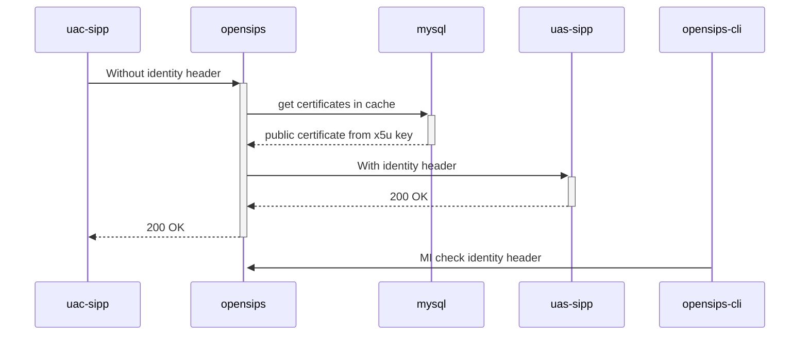

# Diagram


# Explanations:
- opensips gets public certificates from database thanks to `sql_cacher` module.
```
$var(cert) = $sql_cached_value(man_certificates_cache:certificate:https://certs.example.org/public_am.pem);
```
- opensips-cli with check-identity.py script parses and checks Identity header + jwt format:

```
cat MI\ check\ identity\ header.log
jwt is decoded
{'attest': 'A', 'dest': {'tn': ['33987654321']}, 'iat': 1688377317, 'orig': {'tn': '33612345678'}, 'origid': '4437c7eb-8f7a-4f0e-a863-f53a0e60251a'}
key info is <https://certs.example.org/cert.pem>
key alg is ES256
key ppt is shaken

```
