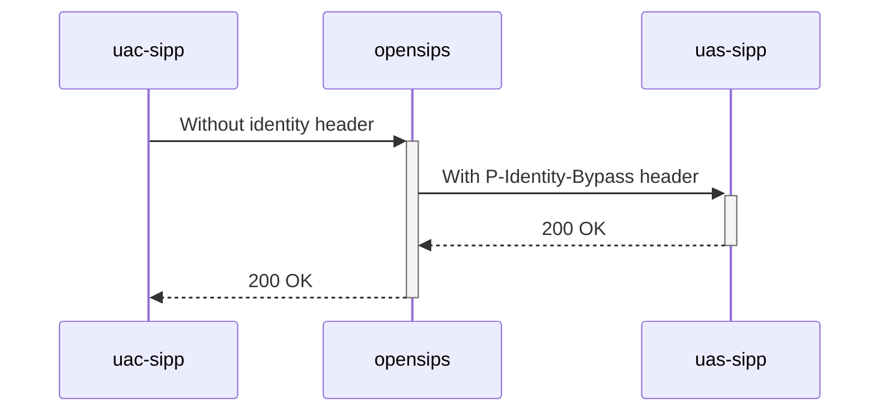

# Diagram

```mermaid
sequenceDiagram
    uac-sipp->>+opensips: Without identity header
    opensips->>+uas-sipp: With P-Identity-Bypass header
    uas-sipp-->>-opensips: 200 OK
    opensips-->>-uac-sipp: 200 OK
```

# Explanations:
`stir_shaken_auth` issue simulation (do not add $var(cert)). So force to send `P-Identity-Bypass` to UAS.

> **Warning** for french reglementation
