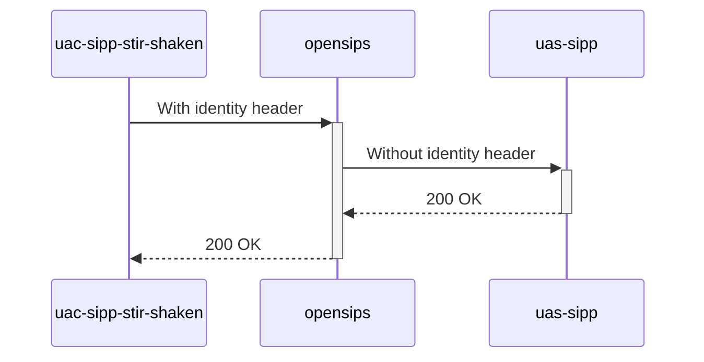

# Diagram

```mermaid
sequenceDiagram
    uac-sipp-stir-shaken->>+opensips: With identity header
    opensips->>+uas-sipp: Without identity header
    uas-sipp-->>-opensips: 200 OK
    opensips-->>-uac-sipp-stir-shaken: 200 OK
```

# Explanations:

