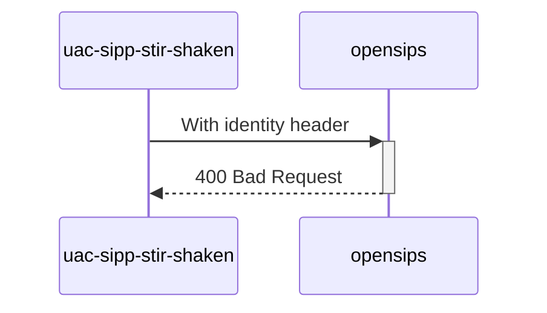

# Diagram


# Explanations:
We forced wrong orig number format
```php
stir_shaken_verify($var(cert), $var(err_code), $var(err_reason), "++4", "$tU");
```

*Test from **MAN_Mode_operatoire_Mecanisme_de_Confiance_v1.7_20230616.pdf** (P59 / line 1)*
