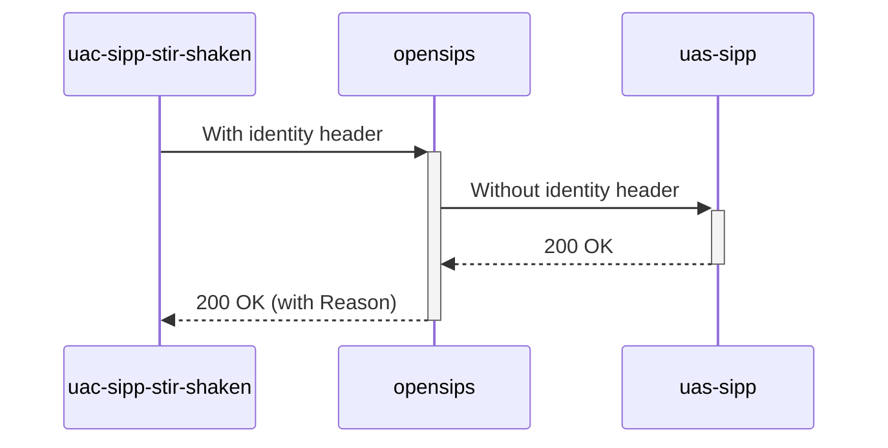

# Diagram


# Explanations:
- We forced wrong orig number format
```php
stir_shaken_verify($var(cert), $var(err_code), $var(err_reason), "++4", "$tU");
```

- In opensips.cfg (during the tests phase)
```php
$var(kill_calls) = false;
```

- Result
Not kill call but just add reason header into `200 OK` to UAC
```php
Reason: SIP; cause=400; text="Bad Request"
```
