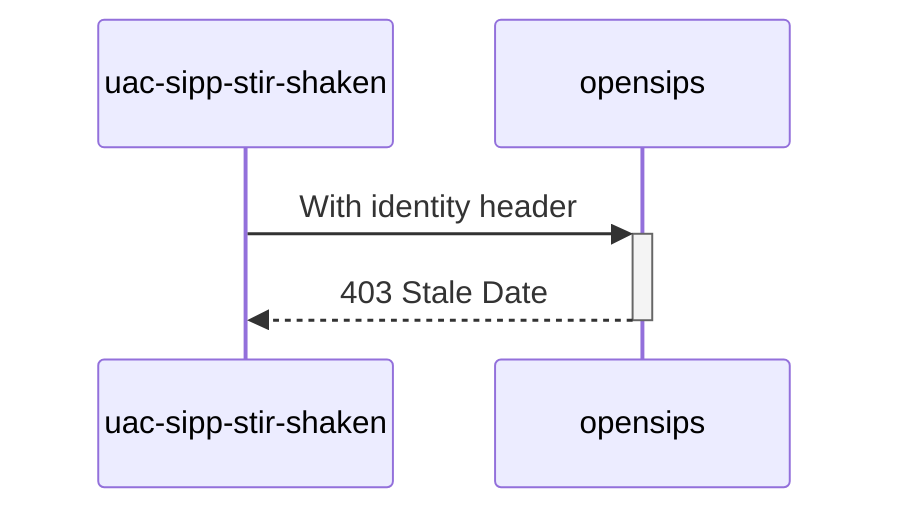

# Diagram


# Explanations:
We forced old Date header in UAC
```php
Date: Sat, 13 Nov 2010 23:29:00 GMT
```

*Test from **MAN_Mode_operatoire_Mecanisme_de_Confiance_v1.7_20230616.pdf** (P59 / line 2)*
