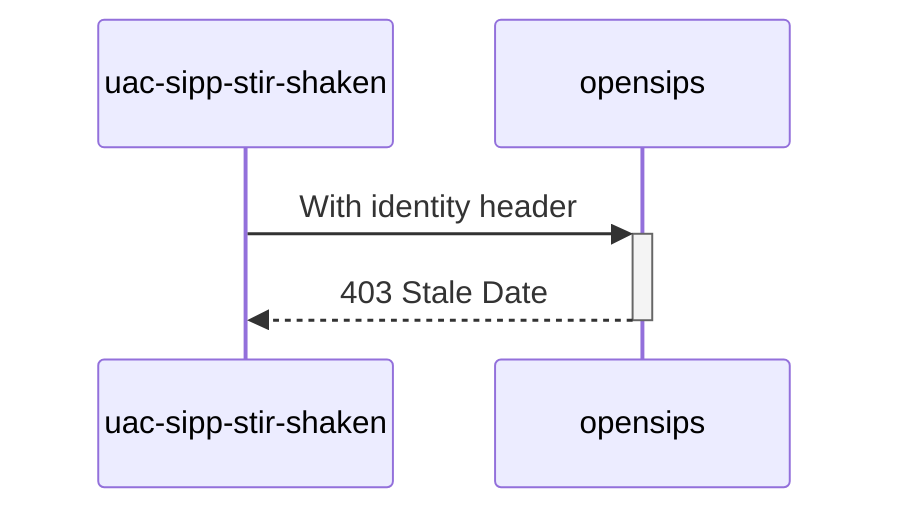

# Diagram

```mermaid
sequenceDiagram
    uac-sipp-stir-shaken->>+opensips: With identity header
    opensips-->>-uac-sipp-stir-shaken: 403 Stale Date
```

# Explanations:
We forced old iat in token
```json
"iat": 1687444148
```

*Test from **MAN_Mode_operatoire_Mecanisme_de_Confiance_v1.7_20230616.pdf** (P59 / line 3)*
