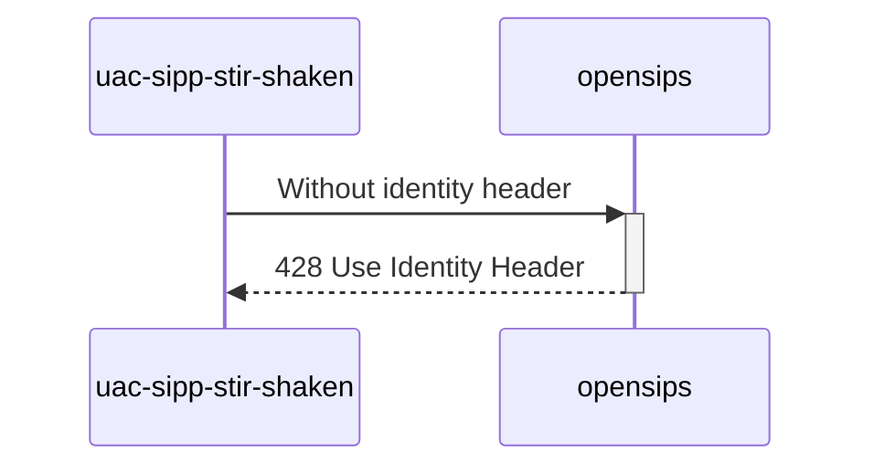

# Diagram

```mermaid
sequenceDiagram
    uac-sipp-stir-shaken->>+opensips: Without identity header
    opensips-->>-uac-sipp-stir-shaken: 428 Use Identity Header
```

# Explanations:
No identity header comes from UAC

*Test from **MAN_Mode_operatoire_Mecanisme_de_Confiance_v1.7_20230616.pdf** (P59 / line 4)*
