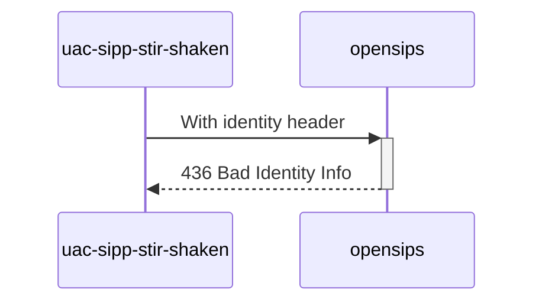

# Diagram


# Explanations:
No info param in Identity header
```
Identity: [stir_and_shaken_jwt];alg=[stir_shaken_alg];ppt=[stir_shaken_ppt]
```

*Test from **MAN_Mode_operatoire_Mecanisme_de_Confiance_v1.7_20230616.pdf** (P59 / line 5)*

# for the future
- Test if it's an valid https URL
