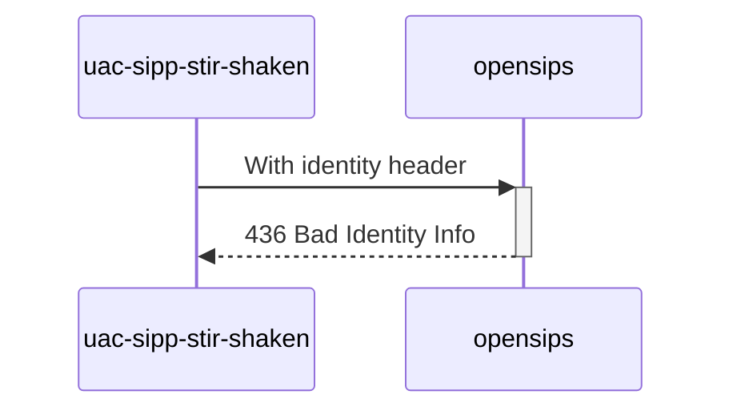

# Diagram


# Explanations:
No ppt param into token's headers

```json
{
  "typ": "passport",
  "alg": "ES256",
  "x5u": "https://certs.example.org/cert.pem"
}
```

*Test from **MAN_Mode_operatoire_Mecanisme_de_Confiance_v1.7_20230616.pdf** (P59 / line 6)*
