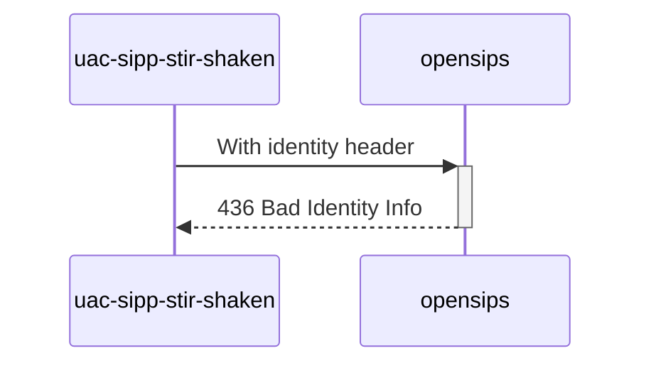

# Diagram


# Explanations:
`x5u` is different from `info`, change `info` in scenario.yml
```yml
stir_shaken_info: "https://certs.example.org/cert_no_https.pem"
```
`x5u` = https://certs.example.org/cert_no_https.pem<br>
`info` = https://certs.toto.com/cert_no_https.pem

*Test from **MAN_Mode_operatoire_Mecanisme_de_Confiance_v1.7_20230616.pdf** (P59 / line 7)*
