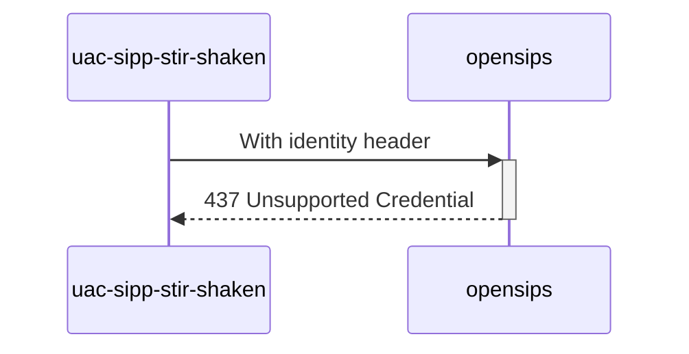

# Diagram


# Explanations:
Test if it's wrong alg in token's header

*Test from **MAN_Mode_operatoire_Mecanisme_de_Confiance_v1.7_20230616.pdf** (P59 / line 10)*

# Future
Use json module to parse `$identity(header)` (but it's not in official opensips docker image)
Ex:
```php
$json(identity_header) := $identity(header);
if (!$json(identity_header/alg) || $json(identity_header/alg) != 'ES256') 
```
