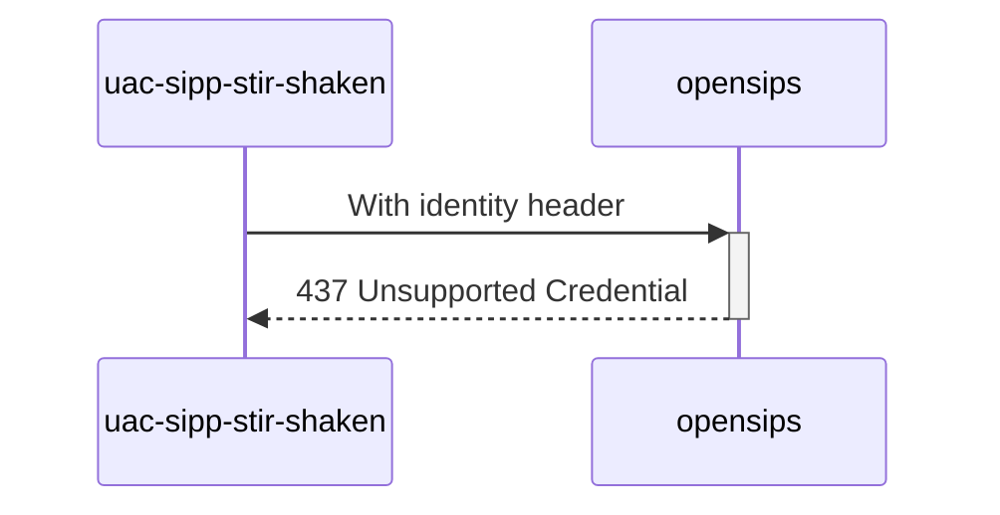

# Diagram

```mermaid
sequenceDiagram
    uac-sipp-stir-shaken->>+opensips: With identity header
    opensips-->>-uac-sipp-stir-shaken: 437 Unsupported Credential
```

# Explanations:
Date of certificate is expired `Expires: 26/06/2023`

*Test from **MAN_Mode_operatoire_Mecanisme_de_Confiance_v1.7_20230616.pdf** (P59 / line 13)*

# Future
