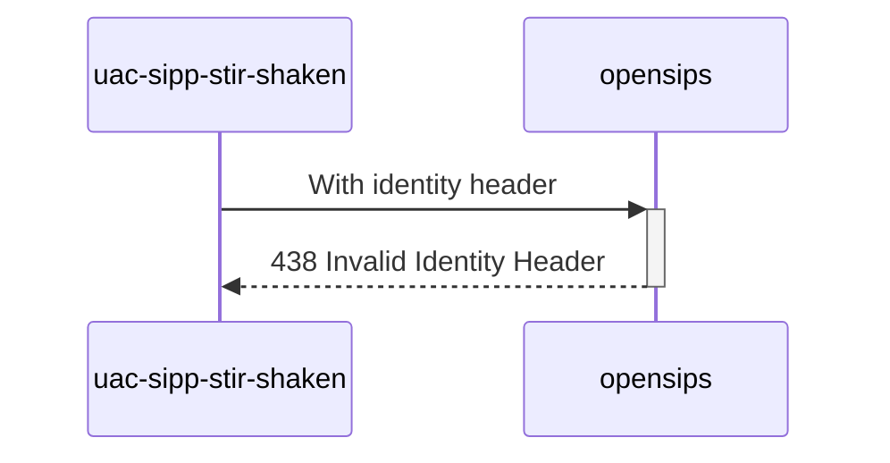

# Diagram


# Explanations:
More than 4 params in Identity header
```
Identity: [stir_and_shaken_jwt];info=<[stir_and_shaken_info]>;alg=[stir_shaken_alg];ppt=[stir_shaken_ppt];toto=titi
```

*Test from **MAN_Mode_operatoire_Mecanisme_de_Confiance_v1.7_20230616.pdf** (P59 / line 16)*

# Future
