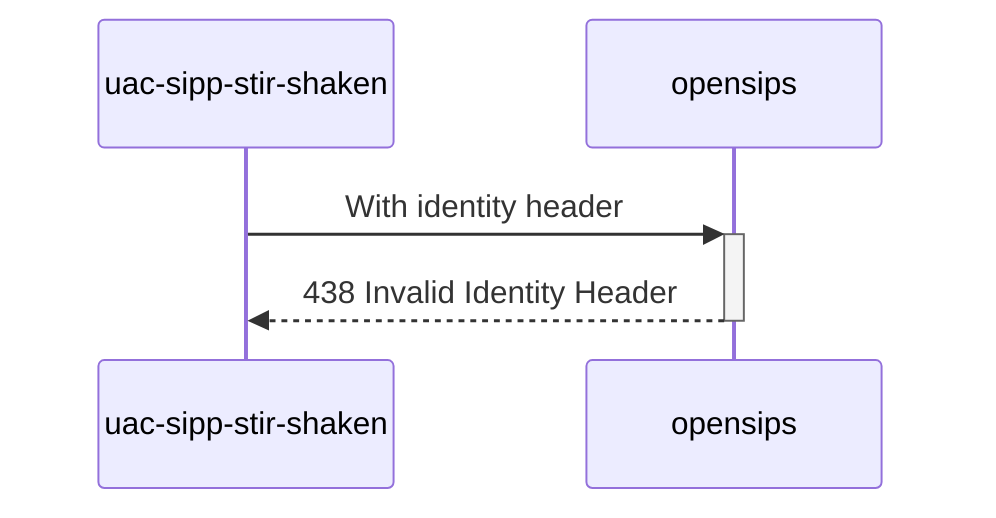

# Diagram


# Explanations:
Wrong `attest` param in token's header, change it in scenario.yml
```yml
stir_shaken_attest: "W"
```

*Test from **MAN_Mode_operatoire_Mecanisme_de_Confiance_v1.7_20230616.pdf** (P59 / line 21)*

# Future
