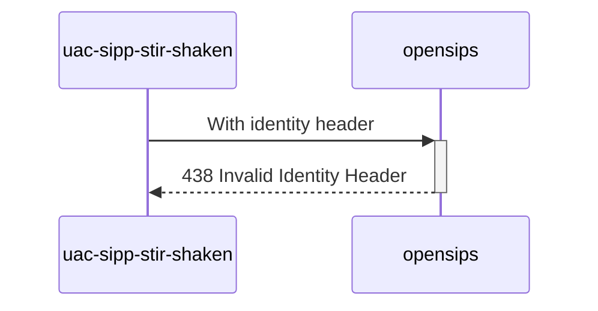

# Diagram


# Explanations:
`dest` and `To` are different
```php
stir_shaken_verify($var(cert), $var(err_code), $var(err_reason), "$var(orig)", "+33999999999");
```

*Test from **MAN_Mode_operatoire_Mecanisme_de_Confiance_v1.7_20230616.pdf** (P59 / line 23)*

# Future
