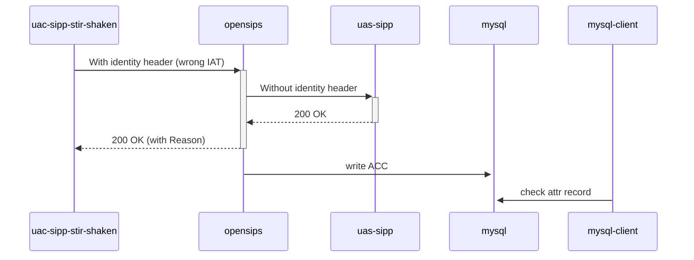

# Diagram


# Explanations:
We use ACC db to store stir and shaken stats (json format) and Python script (not in this repo) as gateway from ACC to APNF's SFTP.

## Add attr field in acc table
```sql
`attr` longtext CHARACTER SET utf8mb4 COLLATE utf8mb4_bin DEFAULT NULL
```
## Push data in attr in json format
```json
{
  "egress_provider": "unknown",
  "terminating_provider": null,
  "provider_disengagement": "no",
  "disengagement_id": null,
  "broken_call": "no",
  "identity_header": "yes",
  "sip_reject_code": 403,
  "sip_reject_subcode": "Stale Date",
  "attestation": "A",
  "redirected_call": null,
  "redirecting_provider": null,
  "redirecting_number": null
}
```

## Source of variables
```bash
# Source for all variables
#
# author_provider_role | compute in other stats scripts (gateway ACC to APNF's SFTP)
# author_provider | compute in other stats scripts (gateway ACC to APNF's SFTP)
# provider | | compute in other stats scripts (gateway ACC to APNF's SFTP)
# optv | null for our purposes
# egress_provider | from opensips
# terminating_provider | from opensips
# displayed_number | from ACC
# displayed_number_type | compute in other stats scripts (gateway ACC to APNF's SFTP)
# pai | from ACC
# called_number | from ACC
# called_number_type | compute in other stats scripts (gateway ACC to APNF's SFTP)
# ingress_provider | from opensips
# start_call_timestamp | from ACC
# provider_disengagement | from opensips
# disengagement_id | from opensips
# broken_call | from opensips
# identity_header | from opensips
# sip_reject_code | from opensips
# sip_reject_subcode | from opensips
# url | compute in other stats scripts (gateway ACC to APNF's SFTP)
# attestation | from opensips
# emergency_call | compute in other stats scripts (gateway ACC to APNF's SFTP)
# redirected_call | from opensips
# redirecting_provider | from opensips
# redirecting_number | from opensips
```

